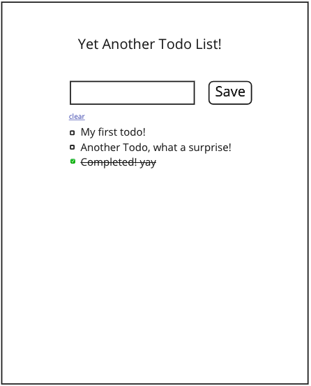

# Yet Another Todo List!

Built to a [spec](./requirements) during a [recorded livestream](https://youtu.be/CeA7UjgreS4) for discussion with software engineering students.



### Quickstart
```sh
$ git clone git@github.com:dearshrewdwit/yatdl-demo.git && cd yatdl-demo
$ npm install
$ npm start
```

### Testing
Feature tests with `cypress`
```sh
$ npx cypress open
```
Component tests with `jest`, `testing-library/react` `testing-library/user-event`, `testing-library/jest-dom`
```sh
$ npm test
```

### Specification
- [requirements](./requirements)
- [mockup](./requirements/images/todo-list-mockup.png)

### Screen Recordings
- [Part 1](https://youtu.be/CeA7UjgreS4) | [Part 2](https://youtu.be/N-ea9bHeNJY)

#### :construction: To do
- [ ] isolate component tests using `__mocks__`
- [ ] extract components
